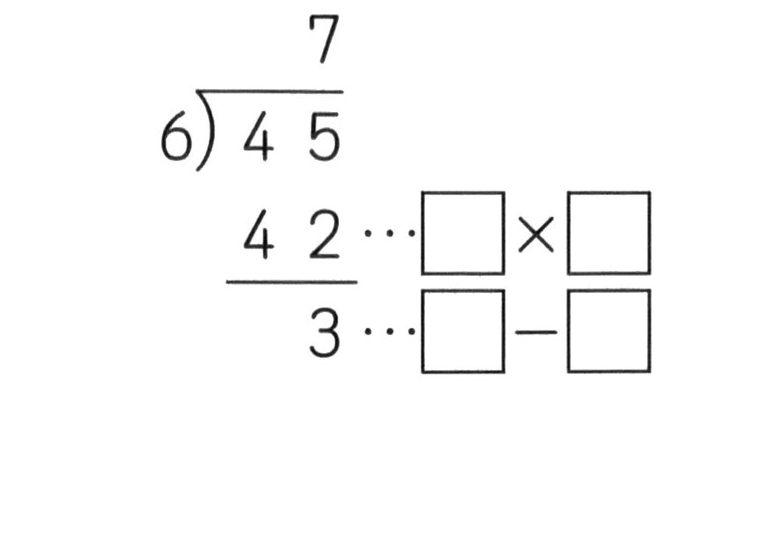

# 勉強アプリ

iPadでも使いやすい、シンプルな自習用アプリです。問題を見て紙などに解答し、アプリ内で解答と解説を確認します。

## 使い方

1. `index.html` をブラウザで開きます。
2. 右上の「読み込み」から `questions.json` を選ぶと、問題集を差し替えられます。
3. やりたいカテゴリを選びます。カテゴリは教科・分野ごとの切り替えです。
4. 「順番」または「復習優先」を選びます。
5. 「ヒント」「解答へ」「解説」を使って学習します。
6. 解答を見たら `Again`, `Hard`, `Good`, `Easy` で自己採点します。

ヒントを見た問題は、`Good` や `Easy` を選んでも習熟度は最大 `Hard` として記録されます。

## 学習データ

学習履歴はブラウザのローカル保存に入ります。サーバーには送信しません。

「今日の履歴」から、その日に解いたカテゴリごとの回数、判定、ヒント使用の有無を確認できます。学習データはJSONとしてエクスポート・インポートできます。

GitHub Pagesなどで公開する場合は、`index.html`, `styles.css`, `app.js`, `questions.json`, `questions-data.js`, `images/` を同じ場所に置きます。

## 画像ファイルの扱い

画像はBase64化、Markdown添付URL化、SVG化、WebP化、再生成をせず、JPEGまたはPNGのバイナリファイルとして `images/` に置きます。アプリとREADMEからは相対パスで参照します。

例:

## 問題データ

問題データの作り方は `DATA_FORMAT.md` を見てください。問題、ヒント、解答、解説はテキストでも画像でも表示できます。
